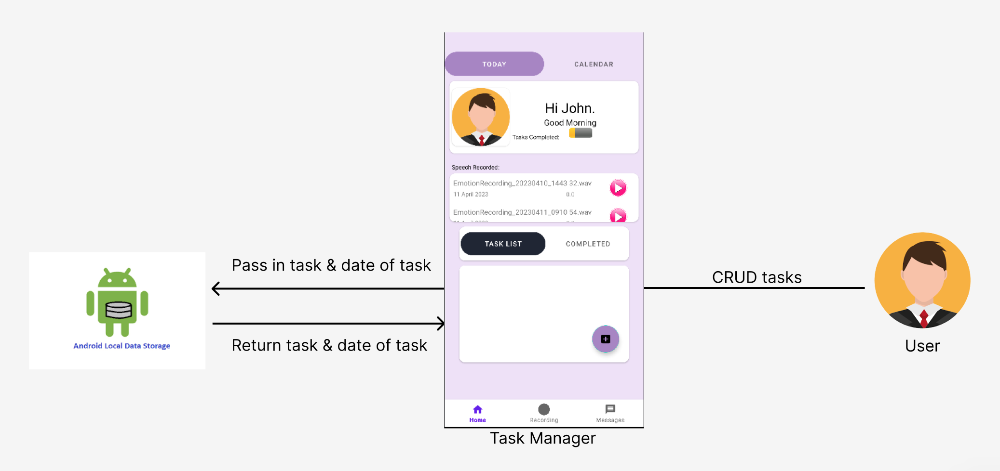
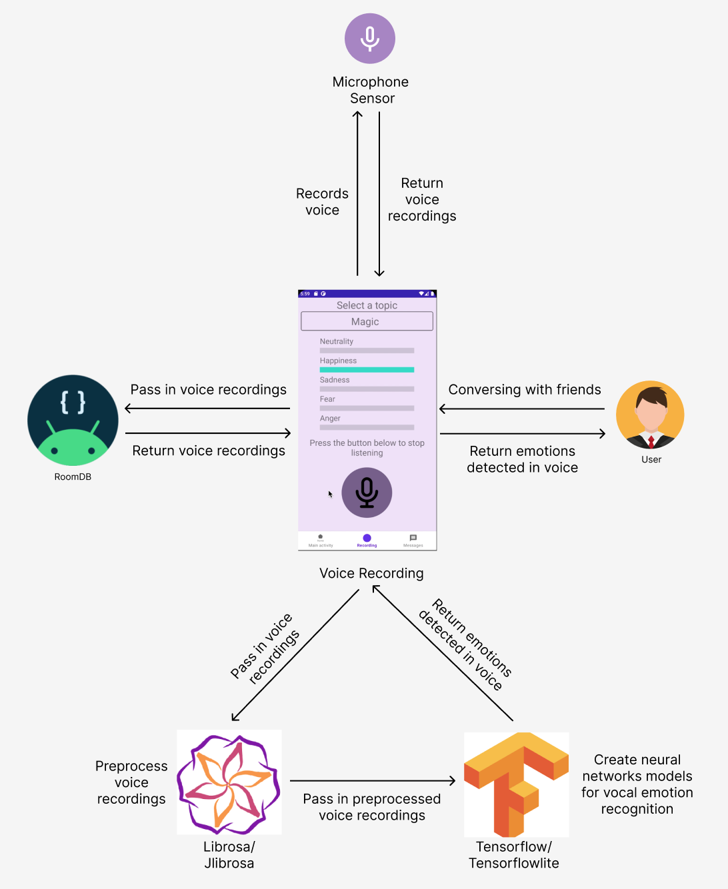
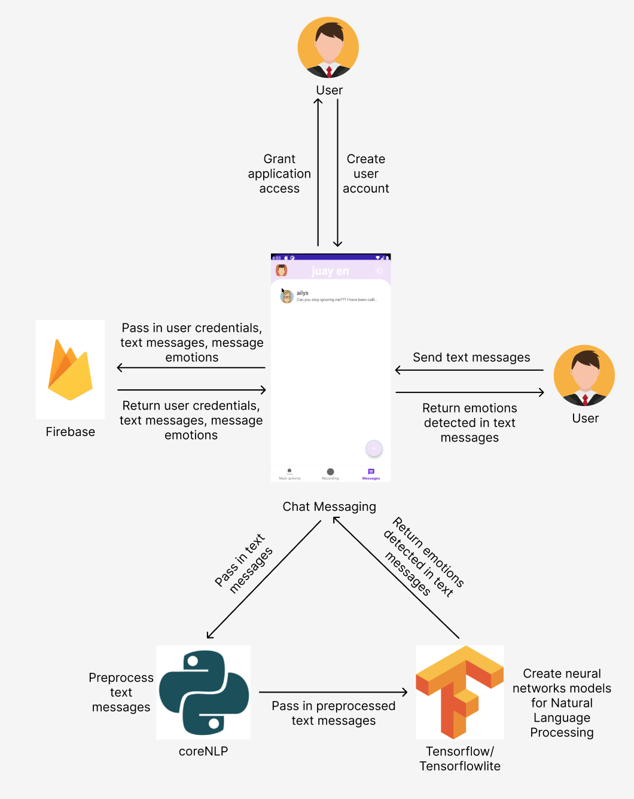

# MoodMagik - Emotion Recognition and Support App for Kids
Android app with Task Manager and Real-Time Emotion Detection in Voice Recordings and Cloud Chat Messages.
## Table of Contents
- [Technologies Used](#technologiesused)
- [Problem Statement](#problemstatement)
- [Usage Demostration](#usagedemo)
- [Solution Architecture Diagram](#solutionarchitecture)
- [Machine Learning] (#machinelearning)
- [App Comprehensive Analysis] (#comprehensiveanalysis)

## Technologies used 

* [![Kotlin][Kotlin]][Kotlin-url]
* [![Firebase][Firebase]][Firebase-url]
* [![TensorFlow Lite][TensorFlow-Lite]][TensorFlow-Lite-url]
* [![RoomDB][RoomDB]][RoomDB-url]
* [![scikit-learn][scikit-learn]][scikit-learn-url]
* [![CoreNLP][CoreNLP]][CoreNLP-url]
* [![JLibrosa][JLibrosa]][JLibrosa-url]

(<a href="#readme-top">back to top</a>)

## Problem Statement & Motivation 

Despite the increasing recognition of the important of mental health, children with mental disabilities still face significant challenges in their daily lifestyle. Hence, we are trying to provide a safe, engaging ,and interactive way for children to mitigate these challenges.

- Challenge 1: Some children who have mental disabilities may experience difficulty in consistently performing day-to-day activities.
- Solution: Task tracker to help children **stick with a routine.**

- Challenge 2: Some children with mental disabilities may struggle to communicate, understand social cues, and manage their emotions. This can lead to isolation, anxiety and behavioral issues.
- Solution: Focus on helping children **identify emotions** through speech and text conversations.

## Usage Demostration 

## Solution Architecture Diagram 
### Feature 1: Task Manager
 

 
The task management feature in the app allows users to organize and track their tasks. Users can add, edit, and mark tasks as complete using a card layout. The tasks are stored locally, providing a convenient and efficient way to manage tasks within the app. Additionally, a calendar screen is available to view tasks organized by date, enhancing task organization and planning capabilities.

### Feature 2: Voice Recording
 

 
The recording fragment in the app allows users to record conversations and view the emotions detected in real time at 10-second intervals. A pop-up fragment shows the dominant emotion and provides suggested actions. The recorded conversations are saved in the DCIM folder for later playback.

### Feature 3: Cloud Chat Messaging
 

 
The cloud chat messaging feature in the app enables users to securely send and store messages in Firebase while providing real-time updates on friends' availability. Emoticons representing emotions are displayed in messages, facilitating better understanding and appropriate responses and also offers insights into the emotional meaning of users' own messages. The feature also provides a quick access to conversation history for a comprehensive communication experience. The chat are stored in firebase.

### Feature 4: Account Manager
The user-friendly registration process in the app enables users to create unique login credentials, which are essential for the cloud chat messaging feature. These credentials ensure that each user is uniquely identified within the messaging system, facilitating secure and personalized communication between users.

## Machine Learning 
### Emotion Detection in Voice Recordings using Audio Analysis

The dataset used for audio analysis model training was sourced from the Ryerson Audio-Visual Database of Emotional Speech and Song (RAVDESS), which included calm, happy, sad, angry, fearful, surprise, neutral and disgust emotions. We chose to focus on four emotions - sadness, anger, fear, and joy - and removed the other data from the dataset.

For the model architecture, we opted for a Convolutional Neural Network (CNN) due to its strong capability in capturing local patterns, extracting hierarchical features, dealing with translation invariance, and effectively learning from limited training data.

To prepare the audio data for model training, we employed a preprocessing pipeline. Initially, we utilized the librosa Python library to load the audio files with default parameters, ensuring consistency between Python and Kotlin. Subsequently, we extracted mel-frequency cepstral coefficients (MFCC) features from the audio files using a sampling rate of 22050 Hz and 40 MFCC features. This transformed each audio file into an array of 40 doubles along with a label indicating the corresponding mood. The class labels were encoded and one-hot encoded, and the features were normalized and expanded in dimensions for compatibility with a our model's requirements.

We split the dataset into training and testing sets, employing a train-test split ratio of 80:20 and ensuring class distribution balance between the sets using the stratify parameter. During training, we adjusted the batch size and learning rate to prevent overfitting. Although the model achieved a validation accuracy of 81.5%, it still exhibited signs of overfitting due to a training accuracy close to 100%. Given more time, we would have explored different model architectures and hyperparameters to improve accuracy and mitigate overfitting.

After completing the training and testing phases, we proceeded to export the trained model into a Tensorflow Lite format. This format was chosen to facilitate seamless integration with Kotlin, enabling the model to be utilized locally within the Android app. By replicating the preprocessing steps performed earlier, we prepared the audio input in the Android app for the model's predictions. Leveraging the trained model, we achieved real-time emotion detection for voice recordings at 10 second intervals. This functionality provided users with immediate insights into the emotions conveyed within their conversations.

### Emotion Detection in Chat Messages using Text Classification 

The dataset used for text classification model training was sourced from Hugging Face (Dair.ai), consisting of English Twitter messages with four emotion labels: sadness, anger, fear, and joy. 

For the model architecture, we opted for a long short-term memory (LSTM) network, a type of recurrent neural network (RNN). LSTM networks excel in capturing long-term dependencies in sequential data like text, making them well-suited for text classification tasks where contextual meaning is crucial.

To ensure the text data was well-prepared for the model, we implemented a comprehensive preprocessing pipeline. This involved several key steps, including converting all characters to lowercase, removing punctuation marks, eliminating stopwords using the NLTK library, tokenization, and applying stemming and lemmatization techniques using the StanfordCoreNLP and evo-inflector libraries to obtain the root words. Furthermore, to transform the text into a format suitable for machine learning models, we utilized the tokenizer class from the Keras preprocessing library. This enabled us to convert the tokenized cleaned text into numerical sequences. Additionally, we leveraged the LabelBinarizer class from the sklearn library to convert the labels into a binary matrix format, ensuring compatibility with our model's requirements.

We split the dataset into training and testing sets, employing a train-test split ratio of 80:20 and ensuring class distribution balance between the sets using the stratify parameter. To train the model, we applied padding to the preprocessed training data using the pad_sequences class from the Keras preprocessing library, making each training sequence length consistent at 100. The LSTM model was then trained on this prepared dataset. After training the model for five epochs, we achieved an impressive testing accuracy of 97.2% and a loss of 0.0521. 

After completing the training and testing phases, we proceeded to export the trained model into a Tensorflow Lite format. This format was chosen to facilitate seamless integration with Kotlin, enabling the model to be utilized locally within the Android app. By replicating the preprocessing steps performed earlier, we prepared the text input in the Android app for the model's predictions. Leveraging the trained model, we achieved real-time emotion detection for individual chat messages. This functionality provided users with immediate insights into the emotions conveyed within their conversations.

## App Comprehensive Analysis 

During the profiling of our application, we conducted various tests to measure its performance on different tasks. When filling up task details and saving them, the CPU utilization reached around 50% with moderate memory usage and light energy consumption. Similarly, during voice recording within the app, the CPU utilization was slightly lower at 41%, with comparable memory usage and energy consumption to the task creation process.

To explore alternative approaches, we also created an API for vocal emotion recognition using Python Flask. The CPU utilization for API calls occurred periodically every 10 seconds, hovering around 40% but not sustained like in-app predictions. Additionally, memory usage was lower, around 128MB, compared to in-app predictions. However, considering these resource usages were within acceptable limits, we ultimately chose to include the model within the app.

Lastly, during cloud messaging with another user, the CPU utilization spiked to approximately 64% while memory usage and energy consumption remained relatively constant. These findings provided valuable insights into the performance characteristics of our application across different functionalities.

<!-- links -->

[JLibrosa]: https://img.shields.io/badge/JLibrosa-FF3399?style=for-the-badge&logo=java&logoColor=white
[JLibrosa-url]: https://github.com/romanowski/JLibrosa

[TensorFlow-Lite]: https://img.shields.io/badge/TensorFlow%20Lite-FF6F00?style=for-the-badge&logo=tensorflow&logoColor=white
[TensorFlow-Lite-url]: https://www.tensorflow.org/lite

[RoomDB]: https://img.shields.io/badge/RoomDB-FF6F00?style=for-the-badge&logo=android&logoColor=white
[RoomDB-url]: https://developer.android.com/training/data-storage/room

[scikit-learn]: https://img.shields.io/badge/scikit--learn-F7931E?style=for-the-badge&logo=scikit-learn&logoColor=white
[scikit-learn-url]: https://scikit-learn.org/

[CoreNLP]: https://img.shields.io/badge/CoreNLP-1B95E0?style=for-the-badge&logo=java&logoColor=white
[CoreNLP-url]: https://stanfordnlp.github.io/CoreNLP/

[Kotlin]: https://img.shields.io/badge/Kotlin-7F52FF?style=for-the-badge&logo=kotlin&logoColor=white
[Kotlin-url]: https://kotlinlang.org/

[Firebase]: https://img.shields.io/badge/Firebase-FFCA28?style=for-the-badge&logo=firebase&logoColor=black
[Firebase-url]: https://firebase.google.com/
